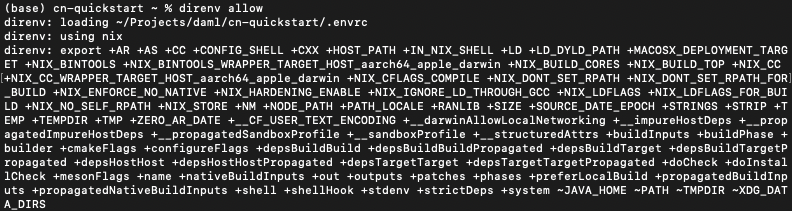
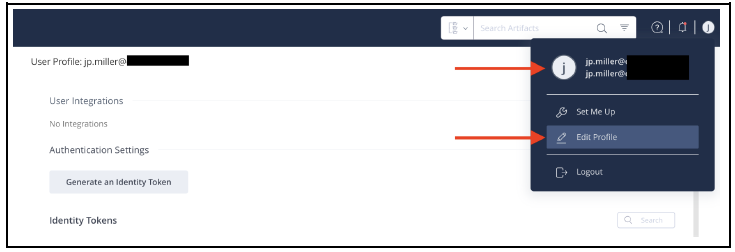
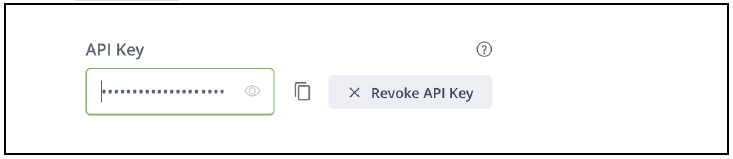
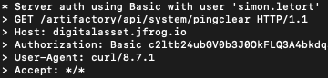
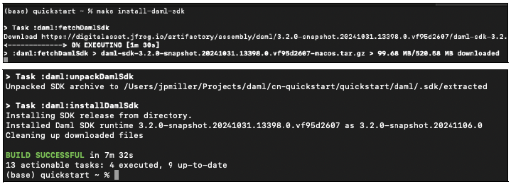
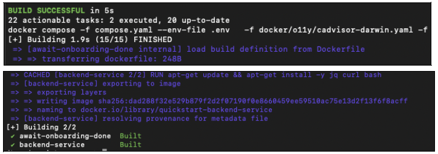
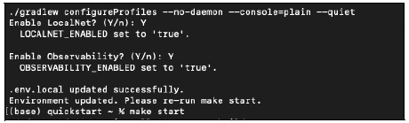
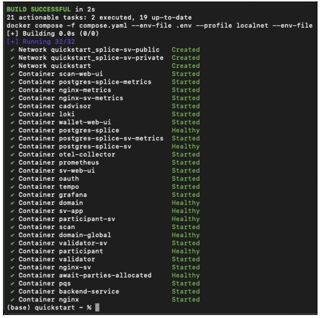
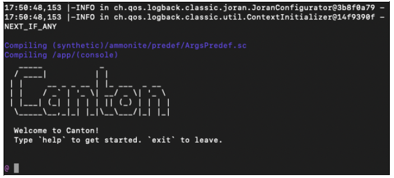
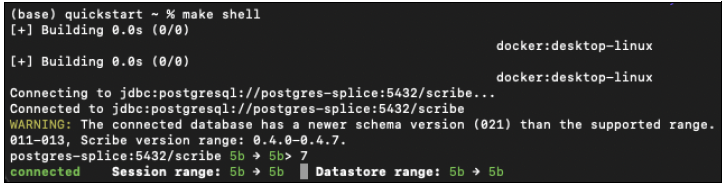

# Installation

## Overview

The CN-QS and its guides are a work-in-progress (WIP). As a result, the CN-QS guides may not accurately reflect the state of the application. If you find errors or other inconsistencies, please contact your representative at Digital Asset.

This guide walks through the installation and LocalNet deployment of the Canton Network Quickstart (CN-QS).

## Prerequisites

Access to the [CN-Quickstart Github repository](https://github.com/digital-asset/cn-quickstart) and [CN Docker repository](https://digitalasset.jfrog.io/ui/native/canton-network-docker) is needed to successfully pull the Digital Asset artifacts from JFrog Artifactory.

Access to the _Daml-VPN_ connection or [a SV Node](https://docs.dev.sync.global/validator_operator/validator_onboarding.html) that is whitelisted on the CN is required to connect to DevNet. The GSF publishes a [list of SV nodes](https://sync.global/sv-network/) who have the ability to sponsor a Validator node. To access DevNet, contact your sponsoring SV agent for VPN connection information.

If you need access or additional support, email [support@digitalasset.com](mailto:support@digitalasset.com).

The CN-QS is a Dockerized application and requires [Docker Desktop](https://app.gitbook.com/s/zKCtppDeJQSD4MowrSxl/overview/credential-utility). Running CN-QS is resource intensive. We recommend allocating 32 GB of memory to Docker Desktop. If your machine does not have that much memory consider declining Observability when prompted.

Other requirements include:

* [Curl](https://curl.se/download.html)
* [Direnv](https://direnv.net/docs/installation.html)
* [Nix](https://nixos.org/download/)
* Windows users must install and use [WSL 2](https://learn.microsoft.com/en-us/windows/wsl/install) with administrator privileges

### Nix Download support

Check for Nix on your machine.

```bash
nix --version
```

If the command returns something like:

```bash
Nix (Nix) 2.25.2
```

Congratulations, you’re done.

Recommended installation for MacOS.

```bash
sh <(curl -L https://nixos.org/nix/install)
```

Recommended installation for Linux. (Windows users should run this and all following commands in WSL 2).

```bash
sh <(curl -L https://nixos.org/nix/install) --daemon
```

## Step-by-step Instructions

### Clone From Github

Clone and cd into the cn-quickstart repository into your local machine.

```bash
git clone https://github.com/digital-asset/cn-quickstart.git
cd cn-quickstart
direnv allow
```



### Artifactory

Necessary artifacts are located in Digital Artifact’s JFrog Artifactory. These files are accessed through the repository’s build system using a \~/.netrc configuration file.

Check if a \~/.netrc file already exists.


```bash
cat ~/.netrc
```

Create or edit the \~/.netrc file at root.

```bash
vim ~/.netrc
```

Add the Artifactory’s login and password.

```bash
machine digitalasset.jfrog.io
login <username>
password <password>
```

Replace `<username>` with the JFrog Artifactory user profile email.



Replace `<password>` with the API Key. Create an API Key if none exists.



The \~/.netrc configuration file should look something like:

```bash
machine digitalasset.jfrog.io
login email@domain.com
password plain_text_api_key_or_password
```

Manually set .netrc’s correct permissions.

```bash
chmod 600 ~/.netrc
```

Check for Artifactory connectivity using .netrc credentials after populating the username and password.

```bash
curl -v --netrc "https://digitalasset.jfrog.io/artifactory/api/system/ping"
```



A response of “OK” indicates a successful connection.

Authentication problems often result in a 401 or 403 error. If an error response occurs, double check \~/.netrc and be sure that .netrc is a source file (in root) and not a local file.

### Docker

Be sure that Docker Desktop is running.

Login to Docker repositories via the terminal.

```bash
docker login digitalasset-docker.jfrog.io
docker login digitalasset-canton-network-docker.jfrog.io
docker login
```

The last command requires a [Docker Hub](https://app.docker.com/) username and password or _Personal Access Token (PAT)_. Commands should return ‘Login Succeeded’.

### Install Daml SDK

`cd` into the `quickstart` subdirectory and install the Daml SDK from the quickstart subdirectory.

```bash
cd quickstart
make install-daml-sdk
```

The makefile providing project choreography is in the quickstart/ directory. make only operates within quickstart/. If you see errors related to make, double check your present working directory.

The Daml SDK is large and can take several minutes to complete.



### Deploy a Validator on LocalNet

From the quickstart subdirectory, build the application.

```bash
make build
```



Once complete, start the application, Canton services and Observability.

```bash
make start
```

The first time running make start, a helper assistant prompts to set up a local deployment. It offers the choice of running DevNet or LocalNet and enabling Observability. In the future, this helper can be accessed by running make setup.

Begin the first application in LocalNet with Observability enabled.

```bash
Enable LocalNet? (Y/n): Y
Enable Observability? (Y/n): Y
```

Consider declining Observability if your machine has less than 32 GB of memory to allocate to Docker Desktop.



If prompted to re-run make start, do so.

```bash
make start
```



`make start` initiates the `LocalNet` containers, which can be computationally demanding. If you see unhealthy containers or error containers on make start try to increase RAM access to Docker to at least 32GB.

In a separate shell, from the quickstart subdirectory, run the Canton Console.

```bash
make console
```



In a third shell, from the quickstart subdirectory, begin the Daml Shell.

```bash
make shell
```



### Closing the Application

_(If you plan on immediately using the CN-QS then delay execution of this section)_

#### Close Canton Console

When complete, open the Canton console terminal. Run exit to stop and remove the console container.

#### Close Daml Shell

In the Daml Shell terminal, execute quit to stop the Shell container

#### Close the CN-QS

Finally, close the application and observability services with make stop followed by make clean-all. This avoids conflict errors on subsequent application builds.

### Next Steps

You have successfully installed the CN-QS. The next section, “Exploring The Demo,” provides a demonstration of the application in LocalNet and DevNet environments.

### Resources

* [Curl](https://curl.se/download.html)
* [Direnv](https://direnv.net/docs/installation.html)
* [Docker Desktop](https://www.docker.com/products/docker-desktop/)
* [Docker Hub](https://app.docker.com/)
* [GSF List of SV Nodes](https://sync.global/sv-network/)
* [JFrog CN Artifactory](https://digitalasset.jfrog.io/ui/native/canton-network-docker)
* [Nix](https://nixos.org/download/)
* [Quickstart GitHub Repository](https://github.com/digital-asset/cn-quickstart)
* [Validator Onboarding Documentation](https://docs.dev.sync.global/validator_operator/validator_onboarding.html)
* [WSL 2](https://learn.microsoft.com/en-us/windows/wsl/install)
